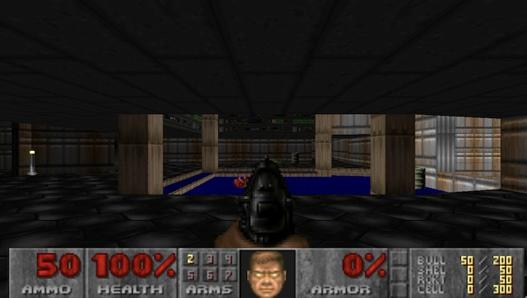
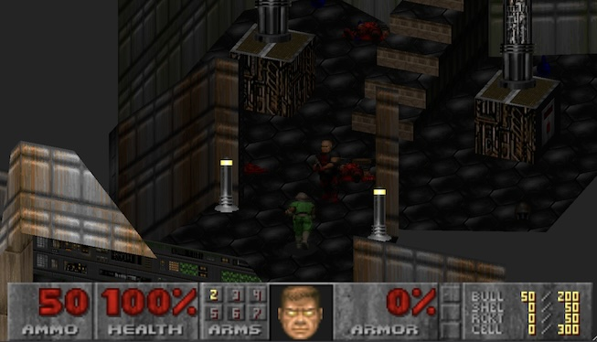

# DUNSHIRE DOOM

A (mostly complete) rewrite of DOOM for the browser. The project started by trying to render DOOM in isometric projection ([kinda like this](https://www.doomworld.com/forum/topic/126329-top-down-isometric-view-from-a-wad-file/)) but quickly snowballed. Dunshire is a nod to Parks and Recreation's [Cones of Dunshire](https://parksandrecreation.fandom.com/wiki/The_Cones_of_Dunshire) because Ben Wyatt, between jobs, feels relatable.

 

## Description

A playable version of DOOM implemented in typescript, rendered in threejs, with a svelte UI. It is not a port of DOOM _per se_ because it deviates from the DOOM implementation where it was fun or interesting to experiment but it should still _feel_ like DOOM. Parts of DUNSHIRE DOOM are derived from the [DOOM source code](https://github.com/id-Software/DOOM) - in particular for animation, monster behaviour, and timing - so if you're familiar with that code you may recognize parts of it in this implementation.

The project started as a playground to dabble in threejs, svelte, and game development for the web. Putting DOOM on the web is not unique, several people have created WASM ports or built partial projects in JS: [smol/doom](https://github.com/smol/doom), [yvesgurcan/jsdoom](https://github.com/yvesgurcan/jsdoom), [jmickle66666666/wad-js](https://github.com/jmickle66666666/wad-js), but this project is probably unique in terms of completeness. At least for a web project. It's not as complete a project as [Helion](https://github.com/Helion-Engine/Helion) or older source ports.

Performance should be fine for Doom, Doom 2, or Final Doom maps. The renderer is [pretty efficient now](https://www.lloydmarkle.com/quieter-life/2024/doom-perf-part-1/) but for large maps or maps with tens of thousands of monsters (like [Cosmogenesis](https://www.doomworld.com/idgames/levels/doom2/Ports/a-c/cosmogenesis) or [Profane Promisland](https://www.doomworld.com/forum/topic/131532-profane-promiseland-rc1-release/)) you'll want to turn off the AI. You can still turn on noclip and fly around the map which is fun! I'm doing some profiling and changes to hopefully make those maps playable but I'm not sure when it be released.

## Getting Started

Install NodeJS 16 or higher and run:
```
## Install NodeJS dependencies
npm install
## Run dev server
npm run dev
```
Open your web browser to http://localhost:5173 and the page should explain the rest.

## Roadmap

Nonexhaustive list of bugs and missing/incomplete features:

* ~~Render performance~~
* Screen wipe
* ~~Victory screens~~
* ~~Automatic weapon switching on low ammo~~
* ~~Shooting angle randomness isn't right (also Revenant rockets)~~
* Sounds for crushers and moving floors (door sounds work!)
* Crackling/popping sounds
* ~~Sound playback, in general, doesn't feel quite right (sounds are too soft or interrupted too often)~~
* Holes in floor/ceiling geometry in some maps (eg. Doom2 MAP25~~, Plutonia MAP25 and MAP29~~)
* Load/Save games
* Lighting effects (like ~~[fake contrast](https://doomwiki.org/wiki/Fake_contrast)~~ and [light diminishing](https://doomwiki.org/wiki/Light_diminishing))
* Automap
* AI performance on large maps
* ~~Fullscreen mode~~

Nice to haves:

* ~~Mobile (touch) controls~~
* Multiplayer (P2P over webrtc?)
* Play demos
* Nightmare monster respawn (and other nightmare monster behaviours)
* More HUD options
* Spin off src/doom into it's own project to make it easier to re-use (or rewrite)
* Improve the intro and menu UI. I don't have a design in mind, I just don't love what's there. It would be really fun to build something DOOM themed.
* Cleanup FIXMEs and TODOs

Long term maybe worth exploring ideas:

* Re-write src/doom in Zig and compile to WASM (for fun?)
* Support other DOOM engine games (Heretic, Hexen, Strife)
* More Boom compatibility like switches, platforms, lights, etc. At least enough to play the community chest maps, ancient aliens, or sunlust.
* Generate BSP, SEGS, and SSECTOR nodes for large maps that don't have them
* Build a few maps that work in orthographic projection and package as an actual game

## Authors

* Lloyd Markle
* You?

### Contributing
I'm happy to take contributions (features or bug fixes) so feel free to reach out in an issue or pull request. I'm sure there is lots of room to improve. I may not be super quick to respond, I've got kids to raise, but my initial goal is to respond to anything that comes in.

I have learned _SOOOOO MUCH_ while building this but that is another story. Suffice to say I am in awe of the creativity of a thousands subtle decisions that go into making a game fun and performant. Hopefully you find the source approachable or feel inspired to improve it or build your own little project.

## License

This project is licensed under the GPLv2 License - see the LICENSE file for details.

## Acknowledgments

Inspiration, code snippets, etc. (in no particular order):

* [DOOM source code](https://github.com/id-Software/DOOM)
* [smol/doom](https://github.com/smol/doom)
* [jmickle66666666/wad-js](https://github.com/jmickle66666666/wad-js)
* [cristicbz/rust-doom](https://github.com/cristicbz/rust-doom)
* [Fabien Sanglard's Game Engine Black Book: DOOM](https://fabiensanglard.net/gebbdoom/)
* [Doom wiki](https://doomwiki.org/) (see source code for specific links)
* [Doomworld Forums](https://www.doomworld.com/forum/) (see source code for specific links)